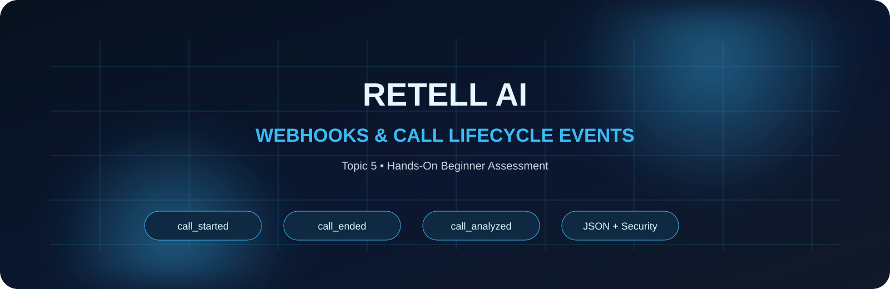
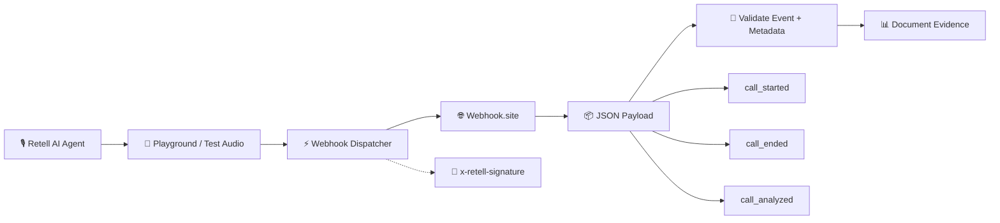

<div align="center">



# ✨ Retell AI — Webhooks & Call Lifecycle Events

### Topic 5 • Hands-On Beginner Assessment

<p>
  <a href="https://www.loom.com/share/08b977186d4b416b85740f966de3d9a7"></a>
  <a href="./Retell_AI_Topic_5_LMS_Assessment_Documentation.pdf"></a>
  <a href="https://webhook.site/5f95e2c4-87d3-4114-bf4a-5d9bdb540666"></a>
</p>

<p>
  
</p>

</div>

---

## 🧭 Quick Navigation

| 🎬 Demo | 📄 Documentation | 🔗 Webhook | 📸 Evidence |
|---|---|---|---|
| [Watch Loom](https://www.loom.com/share/08b977186d4b416b85740f966de3d9a7) | [Open Assessment PDF](./Retell_AI_Topic_5_LMS_Assessment_Documentation.pdf) | [Open Webhook.site](https://webhook.site/5f95e2c4-87d3-4114-bf4a-5d9bdb540666) | [Read Evidence Notes](./EVIDENCE.md) |

> **Assessment focus:** configure a Retell AI webhook, validate lifecycle events, inspect JSON payloads, understand signature verification, and document call metadata.

---

## 🚀 Project at a Glance

This project demonstrates **Retell AI Topic 5 — Webhooks & Call Lifecycle Events** using an HTTPS webhook receiver and the Retell Playground/Test Audio flow.

### Core flow



GitHub supports Mermaid diagrams directly in Markdown, making the lifecycle easy to inspect without external tooling. citeturn0search9

---

## 🧩 What Was Configured

| Component | Configuration |
|---|---|
| **Platform** | Retell AI |
| **Workspace** | `my-project` |
| **Agent** | `Trainee_Sarah_Receptionist` |
| **Test mode** | Retell Playground / Test Audio |
| **Webhook receiver** | Webhook.site |
| **Protocol** | HTTPS POST |
| **Payload type** | `application/json` |
| **Webhook URL** | [Webhook.site endpoint](https://webhook.site/5f95e2c4-87d3-4114-bf4a-5d9bdb540666) |
| **Observed event** | `call_started` |
| **Observed call type** | `web_call` |
| **Security evidence** | `x-retell-signature` header observed |

---

## ⚡ Live Evidence Snapshot

The Retell webhook **Test** successfully delivered a POST request to Webhook.site.

### Observed payload

```json
{
  "event": "call_started",
  "call": {
    "call_id": "test_call",
    "call_type": "web_call",
    "call_status": "ongoing",
    "transcript": [],
    "transport": "livekit",
    "call_cost": {
      "combined_cost": 0
    }
  }
}
```

### Request headers verified

- `content-type: application/json` ✅
- `x-retell-signature` ✅
- POST request received successfully ✅

> **Evidence discipline:** the repository only claims fields that were actually observed. Transcript, recording URL, duration, and final cost should be marked as validated only when those fields are visibly present in a post-call payload.

---

## 🔐 Webhook Security

The delivered request included:

```text
x-retell-signature: v=...,d=...
```

This provides the signature evidence required for the assessment's webhook-security section.

For production integrations, signature verification should be implemented using the current Retell verification guidance rather than hard-coding an outdated header or signing-secret example.

---

## 🧪 Assessment Coverage

| Requirement / Exercise | Evidence |
|---|---|
| REQ-001 Endpoint Registration | ✅ Webhook URL configured |
| REQ-002 Lifecycle Events | ✅ `call_started` observed |
| REQ-003 Payload Schema | 🟡 Start-event schema observed; post-call fields require visible final payload |
| REQ-004 Webhook Security | ✅ `x-retell-signature` observed |
| REQ-005 Real-time Delivery | ✅ POST received immediately after webhook test |
| REQ-006 Interactive Testing | ✅ Retell Test / Playground flow |
| Phone number purchase | **Not required for Topic 5** |

---

## 🎥 Loom Walkthrough

**[▶ Watch the Topic 5 Demo](https://www.loom.com/share/08b977186d4b416b85740f966de3d9a7)**

The demonstration covers:

1. Retell AI webhook configuration
2. Webhook.site endpoint
3. Webhook test delivery
4. JSON payload inspection
5. Signature-header evidence
6. Playground/Test Audio lifecycle flow

---

## 📄 Documentation

### [📄 Open the full LMS Assessment Documentation →](./Retell_AI_Topic_5_LMS_Assessment_Documentation.pdf)

### [🔎 Open Evidence Notes →](./EVIDENCE.md)

The PDF contains the assessment overview, requirements, implementation plan, test plan, checklist, evidence summary, and submission links.

---

## 🖼️ Evidence Gallery

Screenshots can be added under `assets/` and linked here as the assessment evidence grows.

| Evidence | Purpose |
|---|---|
| Retell → Settings → Webhooks | Endpoint configuration |
| Webhook.site POST | Delivery proof |
| JSON payload | Event/schema proof |
| Headers panel | Signature proof |
| Retell Playground | Interactive test proof |

---

## 🧠 Key Concepts Demonstrated

- Webhook endpoint registration
- HTTPS POST delivery
- JSON event payloads
- `call_started` lifecycle event
- `call_ended` / `call_analyzed` lifecycle concepts
- Call metadata extraction
- Webhook signature awareness
- Playground/Test Audio validation
- Evidence-first technical documentation

---

## 🗂️ Repository Structure

```text
retell-ai-topic-5-webhooks-call-lifecycle-events/
├── README.md
├── Retell_AI_Topic_5_LMS_Assessment_Documentation.pdf
├── EVIDENCE.md
└── assets/
    └── (assessment screenshots / evidence)
```

---

<div align="center">

### ⚡ Retell AI • Webhooks • Call Lifecycle • JSON • Security

**Built as a hands-on Topic 5 assessment project.**

</div>
